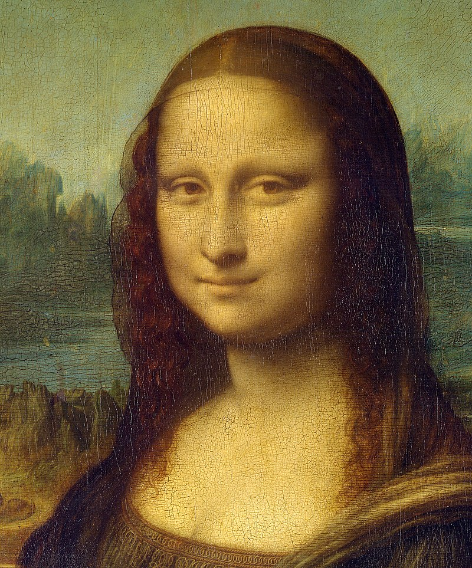
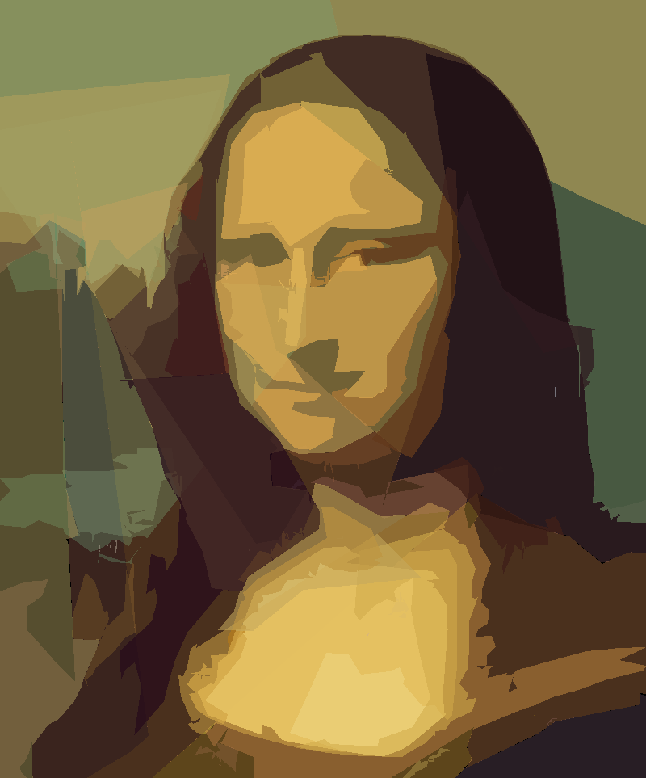

# Replicating the Mona Lisa, using Genetic Algorithms and CUDA

This repo has an implementation of a genetic algorithm, which aims to reproduce a picture
using polygons.

## Prerequisites

- Qt5
- CUDA (and of course, a CUDA-capable GPU).

This has been tested on Archlinux x64, with Qt 5.11 and CUDA 11.3.

## Gallery

<h4>Mona Lisa</h4>

  
  
  

